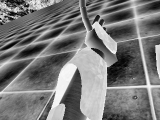
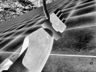
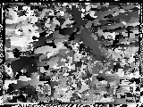

# Stereo Vision  
==========
This a simple CPU implementation of Block Matching (a Stereo Matching Algorithm) using simple Sum of Square difference, rank transform and census transform as matching cost. Defualt use OpenMP optimization (save about 200ms per image), also have the option to use Visual c++ (for windows user) concurrency module to parallel the code (slower than openMP in my case).   

The code can be either compiled to executable with gcc or visual studio with Opencv installed. This have been tested in Ubuntu 18 und Windows 10.    

left image:  
  
right image:  
  
disparity image with rank transform:  
  

Clearly, choosing rank transform or census transform as matching cost parameter make disparity map less noisy. It could probably be due to the nature of these transform, which makes left and right images less sensitive to illumination changes. p.s. using census transform is slower than using rank transform. 

---
## Requirement 

    $OPENCV

**Usage**

    ./stereo_mathing -left=<left image> -right=<right image> -max-disparity=<disparity range> -window_size=<window size for block matching> -tranwin_size=<window size for transformation> -output=<output image file> -parallel=<if you want to run parallel version> -cost=<matching cost function ex: rank or census> -windows=<yes if you want to use concurrrency module>

**Examples**

    ./stereo_matching -left=left.png -right=right.png -max-disparity=50 -window_size=6 -tranwin_size=7 -output=depth_new.png -parallel=yes -cost=rank -windows=yes

